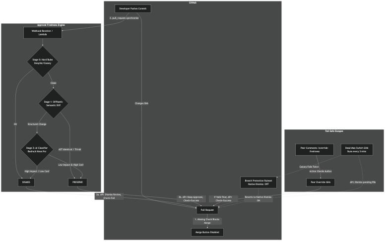

# Approval Freshness Engine



Fail-closed, policy-based replacement for GitHub's blunt "dismiss stale approvals on any push."
Determines whether a human approval is still valid after new commits — **without ever approving anything itself.**

## The invariant
The engine's entire action space is `{dismiss, set-check success|failure, no-op}`. It cannot approve,
merge, or push. Worst-case malfunction ≡ today's behavior or a blocked merge. Enforced by
`test/no_approve_path.test.ts`.

## The ladder
1. **Stage 0 — hard rules (deterministic):** privileged paths (`.tf`, prod, workflows, CODEOWNERS), force-push, non-author commits, injection canaries, size caps → categorical dismiss. No AI.
2. **Stage 1 — semantic diff (deterministic, difftastic):** AST-identical / trivial-class / merge-base-only → preserve. No AI.
3. **Stage 2 — AI classifier (advisory):** low-impact + all deterministic corroboration gates pass → preserve; anything else → dismiss.

## What's actually behind each stage (no magic)

- **Stage 0 is plain TypeScript** (`src/stages/stage0_hardrules.ts`): glob matching (minimatch,
  case-insensitive so `.Github/workflows` can't evade), integer size caps, a boolean force-push
  flag, a string comparison of GitHub-verified commit-author logins against the PR author, and a
  small set of regexes scanned over the diff text. No network, no AI, no state. It can only
  **dismiss** or pass the delta onward — it has no preserve path.
- **Stage 1 is [difftastic](https://difftastic.wilfred.me.uk/)** (`src/stages/stage1_difftastic.ts`),
  an open-source structural diff tool: it parses both versions of each changed file into syntax
  trees (tree-sitter grammars, ~50 languages) and compares the *trees*, so whitespace, formatting,
  changes produce "zero structural changes" while any change to actual code structure does not.
  **Comments are syntax-tree nodes, not whitespace**: adding or editing a comment IS a structural
  change to difftastic, so it does not qualify for `ast_identical` (verified live against
  difftastic 0.69.0 — see docs/TEST-EVIDENCE.md). The binary is checksum-pinned into the container image. Stage 1 can only **preserve**
  (delta provably null / trivial-class) or pass onward — it has no dismiss path. A file in a
  language difftastic can't parse fails closed: no preserve, continue to Stage 2.
- **Stage 2 is one structured model call** (`src/stages/stage2_classifier.ts`): a single JSON
  verdict `{impact, confidence, reasons}` — no tools, no agent loop, versioned prompt — and it is
  *advisory*: preserve requires the model saying `low` **and** confidence ≥ threshold **and** every
  deterministic corroboration gate passing (soft line/file caps, no sensitive patterns, no
  new-dependency heuristic). Any model error, timeout, or gate failure → dismiss.

## What passes and what doesn't — developer scenarios

All scenarios assume an approved PR that the same developer then pushes to. "Preserved" = your
approval survives, check goes green, no re-review. "Dismissed" = exactly what native GitHub does
today: stale approval dismissed, re-review requested, merge blocked until a human re-approves.

**Preserved deterministically — no AI involved (provided no Stage 0 rule below trips):**

| You push… | Path through the engine |
|---|---|
| Ran `prettier`/`gofmt`/`black`; formatting-only diff | Stage 1 `ast_identical` → preserve |
| Re-indented, re-wrapped, added/removed blank lines, added a trailing comma | Stage 1 `ast_identical` → preserve |
| Edited `docs/**` or any `*.md` only | Stage 1 `trivial_class` (docs) → preserve |
| Clicked **Update branch** — no conflicts, your PR's own files untouched | Stage 1 `merge_base_only` → preserve¹ |
| Re-generated a deterministic artifact on an allowlisted `generated` glob | Stage 1 `trivial_class` → preserve |
| Bot-authored PR (e.g. Renovate as PR author) updates only its own allowlisted lockfile | Stage 1 `trivial_class` (lockfiles) → preserve |

**Dismissed categorically at Stage 0 — the AI never even sees these:**

| You push… | Why it dismisses |
|---|---|
| *Any* edit — even one character — to a privileged path: `*.tf`, `**/prod/**`, `.github/workflows/**`, IAM/policy files, dependency manifests, CODEOWNERS-governed paths | `denylist_path` / `codeowners_path` |
| A force-push or rebase — even if the content ends up identical | `force_push` (history since approval can't be verified) |
| A branch where **someone other than the PR author** pushed a commit (or a commit GitHub can't attribute to a verified account) | `foreign_author_commit` |
| A "trivial" change that is thousands of lines / dozens of files | `hard_size_cap` |
| A diff whose text contains classifier-manipulation strings (prompt-injection canaries) | `injection_canary` |
| Any change to the engine's own control surface (workflows, ruleset, stages, prompt, echo…) in a self-governed repo | `self_governance` — the engine never grades its own gates |

**The discretionary middle — real code change on non-privileged paths (Stage 2, never "for sure"):**

| You push… | Likely outcome |
|---|---|
| **Edited or added a code comment** | **Dismiss** in deterministic-only mode. difftastic parses comments as syntax-tree nodes, so a comment change is a structural change — *verified live against difftastic 0.69.0*. Only a model-corroborated Stage 2 can preserve it |
| Changed a log message or user-facing string | Preserve *if* model says low + confidence ≥ threshold + all gates pass; otherwise dismiss |
| Small rename / tiny refactor, no behavior intent | Same — gated preserve possible, never guaranteed |
| Added an `import` or a dependency line anywhere in the diff | Dismiss — `noNewDependencies` gate overrides even a "low" verdict |
| Anything the model calls high-impact, or answers with low confidence, or errors/times out on | Dismiss (`model_high_impact` / `model_low_confidence` / `model_error`) |

Rule of thumb for developers: **prove-ably-nothing changes keep your approval; anything that
touches meaning needs either every gate to agree or a human re-approval — and privileged paths
always need the human.**

**Walkthrough — a push that keeps its approval.** Priya's approved PR gets one more commit: she
ran the formatter (48 lines across 3 files, all her own commits). Webhook arrives → check flips to
`in_progress` on the new head (merge blocked, by construction). Stage 0: no privileged paths, no
force-push, author matches, under caps, no canaries → continue. Stage 1: difftastic parses all
3 files — zero structural changes → **preserve** (`ast_identical`). The engine writes check
`success` on her head SHA; her original approval was never touched; the merge box is green in
seconds. No AI was consulted.

**Walkthrough — a push that gets dismissed.** Marcus's approved PR gets a commit adding retry
logic to the payment client plus a new npm package. Stage 0: paths aren't privileged, size is
fine → continue. Stage 1: difftastic sees real structural changes → continue. Stage 2: the model
says `low` — but the `noNewDependencies` gate spots the added dependency line and fails →
**dismiss** (`corroboration_gate_failed`): stale approval dismissed, check `failure`, re-review
requested with a comment summarizing the delta. His reviewer looks at the current head and
re-approves → the fresh-approval echo flips the check to `success`. Total cost vs today: zero —
this is exactly the re-review native GitHub would have demanded.

**Walkthrough — a push the AI never sees.** Dana's approved PR adds one line to
`.github/workflows/ci.yaml`. Stage 0 dismisses instantly (`denylist_path`): privileged surfaces
categorically require fresh human review, regardless of size or what any model thinks.

¹ Build honesty: the `merge_base_only` bucket has a known implementation caveat in the current
scaffold (the three-dot compare in `src/github/pr.ts` — see FAILURE-MODES.md §4.5) that must be
fixed and verified during P0 before quoting preserve rates for "Update branch" traffic.

## End-to-End Flow & Fail-Safe Mechanics

To make this engine work, **GitHub's native "Dismiss stale pull request approvals" setting must be turned OFF** in enrolled repositories. The engine takes over that responsibility — but the *merge gate itself* is never the engine. It is GitHub's own ruleset enforcement, evaluated natively, on every merge attempt, with no runtime credential able to weaken it. The engine's job is only ever to try to make one boolean true.

**The merge equation** (enrolled repo, per PR, enforced 100% by GitHub — not by the engine):

```
merge allowed  ⇔  approving reviews ≥ 1                                  (ruleset pull_request rule)
               AND check `approval-freshness/evaluated` == success
                   on the CURRENT head SHA, from the engine's GitHub App only
                   (required_status_checks[].integration_id pinned — a same-named
                   check from any other identity, incl. github-actions, is rejected)
```

Status checks are matched strictly per head SHA — a success on a previous commit never carries over (a missing/pending/failed check blocks merge unconditionally). So every new push starts blocked by construction, and only two things can ever turn that check green again:

1. **The engine evaluates the delta and decides PRESERVE** — the normal path. It runs the diff through the 3-stage ladder (below) and, if the change since approval is provably null or corroborated low-impact, sets the check to `success` without touching the approval. If the change is substantive or dangerous, it dismisses the stale approval, sets the check to `failure`, and demands a re-review — merge stays blocked until it does.
2. **A fresh human approval on the exact current head SHA is echoed to check success.** GitHub records the exact commit a review was submitted against (`review.commit_id`) and platform-blocks self-approval. A review that satisfies `state == approved && commit_id == head.sha`, from a human who isn't the PR author, *is* the re-review the system is asking for — echoing it to a check is a mechanical restatement of a platform-verified fact, not a machine judgment. This is implemented twice, redundantly: once in the engine itself (`src/github/freshApproval.ts`, the primary path) and once as a standalone GitHub Actions workflow (`.github/workflows/fresh-approval-fallback.yaml`) that authenticates as the same GitHub App and runs on GitHub's own infrastructure — so the unblock path survives the engine's pod being down.

**The fail-safe story, in one sentence: the ruleset IS the fail-safe.** There is no separate dead-man switch, no auto-revert, no second "native" ruleset state to swap into, and no org-ruleset-write credential anywhere in the system. If the engine crashes, nothing insecure happens — a freshly-pushed PR simply stays in the same natively-blocked state a missing CI check would leave it in. A developer unblocks it exactly the way native GitHub already asks them to: get it re-reviewed. The only "recovery" is a human doing that, on the current head SHA, and the fallback workflow turning that into a green check without the engine needing to be alive. Every failure of every component — model outage, pod crash, webhook loss — resolves to "no success on head SHA," which GitHub already, natively, blocks. Nothing in this design can fail open, and nothing can freeze a merge forever, because a fresh approval is always a way out.

**What that does and does not guarantee.** Guaranteed: every merged PR carries at least one platform-verified human approval; the engine can never approve, merge, or push; privileged paths and the engine's own control surface always require a *fresh* human review; every decision is logged with its evidence. Not guaranteed — and this is the deliberate policy choice, not a gap: a delta that Stage 1 proves semantically null, or that Stage 2 assesses low-impact with every deterministic corroboration gate agreeing, merges **under the original approval, without a fresh human look at that delta.** This engine replaces the *staleness test*, not the review requirement. Orgs that want strictly deterministic behavior run deterministic-only mode (Stages 0–1 live, Stage 2 held in shadow) — today a rollout posture, not yet a config switch (see [Build honesty](#build-honesty)). Stated precisely in [SECURITY-REVIEW.md](docs/SECURITY-REVIEW.md), § "What is guaranteed — and what is not".

## Layout
- `src/stages/` — the ladder (0/1/2) + orchestrator
- `src/github/` — App auth, PR/delta resolution, the actuator (check success/failure + dismiss; no approve path), and the fresh-approval echo (`freshApproval.ts`)
- `src/model/` — provider-agnostic classifier + versioned control-logic prompt
- `src/audit/` — immutable decision events → Loki audit tenant
- `src/runtime/` — the keyed, coalescing, bounded work queue (`queue.ts`) that serializes evaluation per PR and bounds concurrency under load — see [Performance & scale](#performance--scale)
- `src/observability/` — Prometheus registry and metrics (`prom-client`) served at `/metrics`
- `scripts/p0_backfill.ts` — **read-only** evidence spike → "the number"
- `eval/` — golden-set harness (the security evidence)
- `docs/` — See [Documentation](#documentation) below
- `deploy/` — Helm (Deployment/Service/HPA/PDB/Ingress) + Terraform + the static, org-owned ruleset (`deploy/rulesets/`) that is the actual merge gate — never edited at runtime by any automation
- `.github/workflows/fresh-approval-fallback.yaml` — redundant, GitHub-infra-hosted fresh-approval echo (liveness path independent of the engine's uptime)

## Documentation
The `docs/` directory contains all the necessary documents to understand how the engine works and what it does:
- [EPIC.md](docs/EPIC.md) — The high-level product epic and feature breakdown.
- [SECURITY-REVIEW.md](docs/SECURITY-REVIEW.md) — The security one-pager detailing the fail-closed invariant.
- [IMPLEMENTATION-PLAN.md](docs/IMPLEMENTATION-PLAN.md) — The full build and implementation details.
- [RUNBOOK.md](docs/RUNBOOK.md) — The operational runbook for on-call and maintenance.
- [SECURITY-FOLLOWUPS.md](docs/SECURITY-FOLLOWUPS.md) — Disposition of the three security-review follow-up items (custody decision + two fixes), with evidence.
- [ENGINEER-FAQ.md](docs/ENGINEER-FAQ.md) — The five hard questions from engineering review answered against the code, the honest ROI discussion, and a dozen-plus anticipated Q&As.
- [FAILURE-MODES.md](docs/FAILURE-MODES.md) — Exhaustive failure matrix (component × failure → merge-gate state → recovery), the engine-down fallback sequence diagram, and open findings.
- [ROLLOUT-PLAN.md](docs/ROLLOUT-PLAN.md) — The P0→P4 migration plan: measure-first kill gate, shadow mode, deterministic-only pilot, Stage-2 sign-off, org-wide enrollment.
- [HOW-IT-WORKS.md](docs/HOW-IT-WORKS.md) — Plain-English explainer for non-technical readers, with a simple flow diagram.

## Start here
1. Read the [SECURITY-REVIEW.md](docs/SECURITY-REVIEW.md) and [IMPLEMENTATION-PLAN.md](docs/IMPLEMENTATION-PLAN.md) to understand the architecture.
2. `npm i && npm test` — see the invariant + Stage 0 + adversarial gates pass.
3. `npm run p0 -- --days 90 --repos org/a,org/b` — produce the % number (read-only).

## Implementation Runbook — deploying your own instance

Anyone forking this repo needs to provide exactly four things: **a GitHub App** (the engine's
identity), **a place to run the pod** (EKS or any k8s), **the org ruleset** (the actual merge
gate), and **two org-level Actions credentials** (only if you want the optional fallback
workflow). Follow these steps in order — the order matters, because each step is fail-closed
against the next one being missing.

### 1. Fork and complete the stubs
Fork the repo, then complete the deploy-time stubs in `src/` (marked, see
[Build honesty](#build-honesty)): `loadConfig()`, blob materialization, and your model provider
wiring in `src/model/provider.ts` (Bedrock or Anthropic API). `npm i && npm test` must stay
green — the invariant tests are your regression harness, not optional.

### 2. Create the GitHub App (the engine's identity)
Create a new GitHub App in your org (`Settings → Developer settings → GitHub Apps`):
- **Permissions (least privilege — do not add more):** Checks: Read & write · Pull requests:
  Read & write · Contents: Read-only · Metadata: Read-only. Explicitly NOT: Administration,
  Actions, Workflows, Members, or any org permission. The App must be *unable* to merge, push,
  or edit rulesets even if its key leaks.
- **Webhook:** URL → your engine's ingress `/webhook`; generate a strong webhook secret.
  Subscribe to events: `pull_request`, `pull_request_review`, `push` (the `push` event feeds the force-push `forced` flag into the ladder wiring at deploy time; the scaffold routes only the first two).
- **Record two values:** the **App ID** (numeric, on the App settings page — this is also the
  `integration_id` for step 4) and the **private key** (generate and download once).
- **Install** the App on your org, scoped to **only the repos you will enroll** — never
  "all repositories".

### 3. Deploy the engine pod
Use `deploy/helm/`. Supply via your secrets path (ESO/Secrets Manager — never in Git):
App ID, App private key, webhook secret; set `MODEL_PROVIDER`/`MODEL_ID`. Start with
`DRY_RUN=true` (shadow mode: decisions are logged, nothing is written to GitHub) and watch the
audit log until you trust the decisions, then flip it off. Wire `src/audit/` output to your
log stack (e.g. Loki) — every decision, dismissal, and fresh-approval echo is a structured event.

Set the **required** `selfGovernedRepos` config field (`EngineConfig`, `src/config/schema.ts`) to
the list of repos that host this engine's control surface — typically
`["<your-org>/approval-freshness-engine"]` plus any fork/ops repos carrying it. This is what makes
the engine refuse to grade its own gates: a PR against one of these repos that touches the control
surface is categorically dismissed (`self_governance`) for human review, never preserved. The field
is required precisely so this is a conscious deploy-time decision, not a default someone forgets.

### 4. Apply the org ruleset (the actual merge gate)
This is the security-critical step. Follow `deploy/rulesets/README.md` exactly:
1. In `deploy/rulesets/enrolled-ruleset.json`, replace the two placeholders:
   - `integration_id: 0` → **your App ID from step 2.** The shipped `0` is a deliberately
     invalid sentinel: applied unmodified, the check can never be satisfied and merges block
     (fail-closed), rather than silently accepting a spoofable unpinned check.
   - `repository_name.include` → your enrolled repos (explicit names/patterns, or switch to a
     repository custom property — both documented in the rulesets README).
2. Apply it **org-level** (`POST /orgs/{org}/rulesets`), enforcement `active`. Org-level means
   repo admins structurally cannot weaken it.
3. Make sure no *other* ruleset or classic branch protection on those repos still has native
   "Dismiss stale pull request approvals" or "Require approval of the most recent reviewable
   push" enabled — this ruleset owns staleness now (both are correctly `false` inside it).
4. Optional hardening (recommended): "restrict who can dismiss reviews" → {your App, a
   break-glass team}. The exact API field must be confirmed live first — the rulesets README
   has the verification commands.
5. Replace the CODEOWNERS placeholder team. `.github/CODEOWNERS` ships with the placeholder owner
   `@YOUR-ORG/security-review` over the engine's control surface (workflows, ruleset, helm, config,
   prompt, gates, the echo, the actuator, the invariant tests). Replace it with a **real** security
   team and make sure the ruleset's `require_code_owner_review: true` (already in
   `enrolled-ruleset.json`) is active on your engine repo — otherwise the control surface has no
   enforced reviewer. This pairs with `selfGovernedRepos` (step 3): the engine withholds its
   opinion on control-surface PRs, and CODEOWNERS makes sure a human security reviewer is required.

### 5. Enable the fresh-approval fallback (optional but recommended)
This is the unblock path that works while the pod is down. It must exist **in each enrolled
repo** (copy `.github/workflows/fresh-approval-fallback.yaml` in via your enrollment
automation or a template repo), and it needs two org-level Actions credentials, both scoped to
enrolled repos only:
- org **variable** `AFE_APP_ID` = the App ID from step 2
- org **secret** `AFE_APP_PRIVATE_KEY` = the App private key

Read the workflow's header comment first — it documents the key-custody trade-off (a second
copy of the App key lives in Actions secrets). An org may deliberately skip this step and stay
fully fail-closed; the cost is that during an engine outage, blocked PRs wait for the engine
to return (or an org owner's audited break-glass) instead of being unblocked by a fresh review.

### 6. Verify with a live drill (do not skip)
On a throwaway enrolled repo:
1. Open a PR, get it approved, push a trivial commit → the PR must show **blocked** on
   `approval-freshness/evaluated` until the engine reports (proves the gate).
2. Push a whitespace-only change → engine should set `success` without dismissing (proves the ladder).
3. Kill the engine pod, push again → PR stays blocked indefinitely (proves fail-closed, no timer).
4. While the pod is still dead, have a peer re-approve on the current head → the fallback
   workflow must flip the check green within ~a minute (proves the unblock path).
5. From a plain Actions workflow with `checks: write`, try to create a check named
   `approval-freshness/evaluated` with `conclusion: success` → the merge box must show it as
   **not** satisfying the requirement ("not set by the expected GitHub App") — proves the
   `integration_id` pin. If this step fails, STOP: your ruleset is not pinned.
6. Restart the engine; confirm normal evaluation resumes on the next push.
7. On the engine repo itself (enrolled with `selfGovernedRepos` set), open a PR touching
   `src/model/prompt.ts` (or any control-surface path) → the engine must **dismiss** with reason
   `self_governance` (it never grades its own gates), and the PR must **demand a CODEOWNERS
   security review** before it can merge. Proves both control-surface governance halves.

### 7. Operate
Set up the drift-monitoring query from `deploy/rulesets/README.md` (alert on any ruleset
change — a monitoring aid, never an auto-repair), and read `docs/RUNBOOK.md`: the "engine
down" procedure is deliberately *"nothing is required for safety — fix the pod at leisure;
developers unblock themselves with a fresh review."*

## Performance & scale

The engine has to keep up with many PRs pushing and being reviewed in parallel without either
wedging on a slow one or racing itself on a fast one. This is a queueing problem, not a bigger-box
problem, so scale lives in `src/runtime/queue.ts`, not in replica count alone.

**The queue is the scale core.** Every webhook event is enqueued under a key of
`${owner}/${repo}#${prNumber}` before it's evaluated, with three properties that fall directly out
of the merge equation above:
- **Coalescing.** If a task for a key is still *waiting* (not yet started) when another event for
  the same key arrives, the new task replaces it — the superseded task is dropped, not run. This
  is safe, not just fast: required checks are matched strictly per head SHA (see above), so
  evaluating a SHA that a later push has already superseded is pure waste. A burst of pushes to
  the same PR costs one evaluation, not N.
- **Per-key serialization.** Two tasks for the same key never run concurrently. This is what
  keeps a `synchronize` evaluation and a `pull_request_review` fresh-approval echo on the same PR
  from racing each other's GitHub API calls — both event types are routed through the same key
  for exactly this reason.
- **Bounded concurrency and size.** A global cap (`AFE_WORKER_CONCURRENCY`, default 16) limits
  how many tasks run at once; a bounded pending-key limit (`AFE_QUEUE_MAX_PENDING`, default 1000)
  caps memory under a webhook storm. Overflow is a **rejection, not a crash** — the webhook was
  already 202'd, so an unprocessed event just leaves the check missing, i.e. a blocked merge, the
  same safe-but-slow state a lost webhook already leaves (recoverable by reconciliation or a fresh
  re-review, same as any other outage — see the runbook above).

**Graceful shutdown is drain, not kill.** On `SIGTERM` (rolling update, scale-down, node drain),
the server flips `/readyz` to `503` immediately — so the Service stops routing new traffic — then
waits for in-flight queue work to finish, up to `AFE_SHUTDOWN_GRACE_MS` (default 25s), before
exiting cleanly. Work that's still running when the grace period ends is simply abandoned, and
that is fine **by construction**: an unresolved check is exactly as safe as a `failure` one (§"the
fail-safe story" above), so an undrained task never produces an unsafe state — it just leaves that
one PR blocked a little longer, no different from any other lost job. The Helm chart keeps
`terminationGracePeriodSeconds: 30` above the drain budget so Kubernetes' SIGKILL can never land
mid-drain, and there's deliberately no `preStop` hook — the distroless image has no shell to exec
one in, so the drain has to (and does) live entirely in application code.

**The health contract**, used by both Kubernetes and the Helm defaults below:
- `GET /healthz` — liveness: the process is up. Independent of backlog — it only trips on a true
  hang, never on "busy."
- `GET /readyz` — readiness: `200` while accepting work, `503` from the instant shutdown begins.
  This is the single signal that pulls a draining pod out of the Service's endpoints.
- `GET /metrics` — Prometheus exposition (`prom-client`): default process metrics plus
  `afe_webhooks_total{event,outcome}`, `afe_queue_running`/`afe_queue_waiting` gauges,
  `afe_queue_coalesced_total`, `afe_queue_rejected_total`, `afe_task_failures_total`, and
  `afe_task_duration_seconds{kind}`.

**Autoscaling and disruption budgets** (`deploy/helm/values.yaml`) default to `minReplicas: 2` /
`maxReplicas: 10` at 70% CPU (`autoscaling.*`, gated on `autoscaling.enabled`), plus a
`PodDisruptionBudget` with `minAvailable: 1` (`pdb.enabled`, default true) so voluntary
disruptions — node drains, rolling updates — can never take the webhook receiver to zero capacity.
Combined with `rollingUpdate.maxUnavailable: 0` on the Deployment, capacity never dips during a
deploy either; the surge replica absorbs it instead.

**difftastic ships inside the image**, not as a runtime fetch: the container build downloads a
pinned, checksum-verified difftastic release binary for the target arch and copies it into the
final distroless stage (`DIFFT_BIN=/usr/local/bin/difft`) — no network dependency, no version
drift, no shell available at runtime to fetch one anyway. Stage 1's temp blobs
(`materializeBlobs`) are written under `/tmp`, the one writable path on an otherwise
`readOnlyRootFilesystem` container, backed by a size-capped `emptyDir` (`tmp`, 256Mi) that's wiped
with the pod on every restart.

## Build honesty
Scaffold written for review clarity; `loadConfig()`, blob materialization, and the model
provider wiring are marked stubs to be completed at deploy time. The decision logic, types,
tests, and control flow are complete and reviewable.
