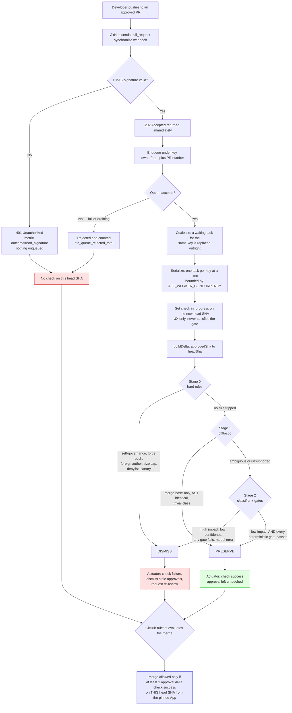
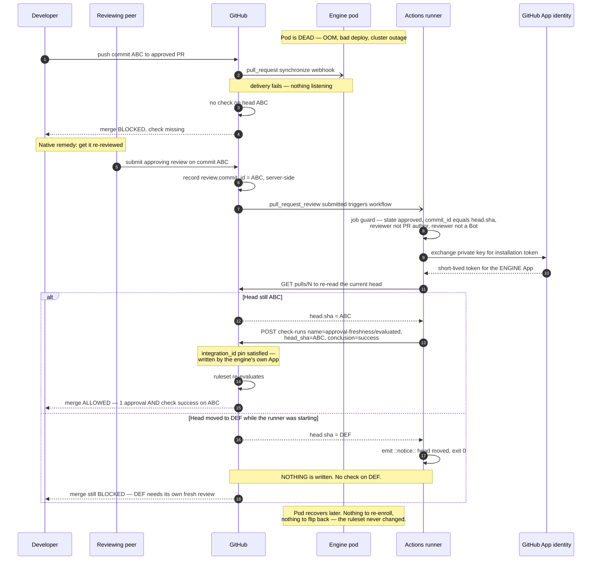
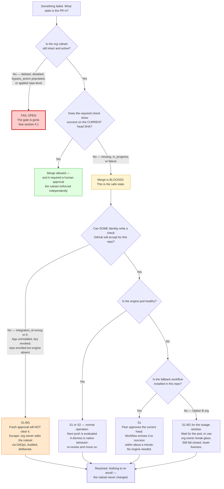

# Failure Modes — Approval Freshness Engine

**Purpose.** Every way this system can fail, what state it leaves a pull request in, who is
blocked, how it recovers, and how you find out. This is the adversarial companion to
`README.md` §"End-to-End Flow & Fail-Safe Mechanics" — that section states the fail-safe claim,
this one tries to break it.

**How to read this document.** The design claim is that every failure terminates in one of
exactly two safe states. This document holds that claim to the fire and reports where it does
not hold. Four terminal codes are used throughout:

| Code | Meaning | Safe? | Self-service? |
|---|---|---|---|
| **S1** | Native block. The required check is missing, pending, or failed on the current head SHA. **A fresh human approval on that SHA clears it.** | Yes | Yes |
| **S2** | Engine behaves as native GitHub does today — a stale approval is dismissed and re-review is requested. Identical to `dismiss_stale_reviews_on_push: true`. | Yes | Yes |
| **S1‑BG** | Native block, but **a fresh approval cannot clear it** — no identity in the system can write a check GitHub will accept. Escape requires an org owner's audited ruleset or App action (break-glass). | Yes | **No** |
| **F‑OPEN** | **Fails open.** The merge gate is weakened or absent. | **No** | n/a |

Everything the engine itself can do lands in **S1** or **S2**. The exceptions are all
*configuration and custody* failures, and they are enumerated explicitly in
[§4 Critical findings](#4-critical-findings). Do not skip §4.

**Verification basis.** Every row below was checked against the code on branch
`prod-hardening` at `745657c`, plus the uncommitted working-tree change to `src/index.ts` that
adds `opened` / `reopened` / `ready_for_review` to the pending-check actions. File:line citations
are given so a reviewer can re-verify rather than take this document's word for it. Where the
shipped scaffold differs from the documented target design, the row says so — see
[§5 Build-honesty caveats](#5-build-honesty-caveats). `src/index.ts` was being edited
concurrently while this document was written; if its line numbers have shifted, the cited symbol
names remain correct.

---

## 1. The two facts everything else follows from

Before the matrix, the two platform facts that make almost every row land in **S1**:

1. **The merge gate is GitHub's, not the engine's.** Merge requires
   `approving reviews >= 1` **AND** check `approval-freshness/evaluated == success`
   *on the current head SHA*, from the engine's GitHub App only
   (`deploy/rulesets/enrolled-ruleset.json:22-43`). No runtime component holds a
   ruleset-write credential.
2. **Required checks are matched strictly per head SHA.** A success on a previous commit never
   carries over. So *every new push starts blocked by construction*, and the absence of a
   success — from a crash, a lost webhook, a dropped queue task, an OOM, whatever — is
   indistinguishable from a deliberate `failure`. **There is nothing the engine can fail to do
   that unblocks a merge.**

The corollary is the whole safety argument: the engine's failure modes are all *omissions*, and
an omission is fail-closed. The dangerous failures are therefore never in the engine — they are
in the ruleset, the App identity, and the enrollment scope. That is what §4 is about.

---

## 2. Failure matrix

### 2.1 Engine runtime

| # | Failure | What actually happens (verified) | Merge-gate state | Who is blocked | Recovery | Detection |
|---|---|---|---|---|---|---|
| 1 | **Webhook delivery lost** (network, GitHub outage, ingress 5xx) | Engine never learns of the push. No check is written for the new head SHA. | **S1** — check absent → merge blocked | Author of that one PR | Fresh approval on current head → echo (engine `freshApproval.ts:141` or the Actions fallback) writes `success`. GitHub's own webhook redelivery may also resolve it. | Gap between GitHub's App webhook delivery log and `afe_webhooks_total{outcome="verified"}`. No engine-side alert exists for a delivery that never arrived — see §4.4. |
| 2 | **Engine pod crash / OOM-kill** mid-task | `uncaughtException` exits immediately without draining (`src/index.ts:493-499`), deliberately: process state is unknown. In-flight tasks die. Container restarts; queue is in-memory and lost. | **S1** — checks for in-flight PRs stay missing or stuck `in_progress` | Authors of PRs whose tasks were in flight | Fresh approval on current head. **Note:** nothing re-drives the lost task — see finding §4.4. | `kube_pod_container_status_restarts_total`; liveness probe `/healthz` (`deployment.yaml:71-75`); process metrics on `/metrics`. Memory limit is `768Mi` (`values.yaml:31`). |
| 3 | **All replicas down** (bad deploy, node loss, namespace deleted) | Every webhook delivery fails at the ingress. Zero checks written. This is the Tier-3 "engine down" state in `docs/RUNBOOK.md:17,35-50`. | **S1** for every enrolled PR pushed during the outage | All authors who push during the outage | **This is what the fallback workflow exists for.** Peer re-approves on current head → `.github/workflows/fresh-approval-fallback.yaml` writes `success` from GitHub's infra as the same App. If the org declined the fallback (README step 5 is optional), PRs wait for the pod or an org owner's break-glass. | Ingress 5xx rate; `up{job="afe"}`; PDB `minAvailable: 1` (`values.yaml:37-38`) makes this impossible via *voluntary* disruption. |
| 4 | **Queue overflow** (webhook storm > `AFE_QUEUE_MAX_PENDING`, default 1000 waiting keys) | `WorkQueue.enqueue` returns `false` (`queue.ts:141-145`). **Rejection, never a throw or crash** — the file header states this as a hard requirement (`queue.ts:16-20`). The 202 was already sent (`index.ts:198`), so GitHub sees success and does not retry. Caller logs a warning (`index.ts:291`, `index.ts:343`). | **S1** — check simply never written | Authors of the rejected PRs | Fresh approval on current head. | `afe_queue_rejected_total` (`metrics.ts:80-84`). **Alert on any non-zero rate** — this counter is only ever incremented by overflow or drain refusal. `afe_queue_waiting` gauge trends toward the cap first. |
| 5 | **Task coalescing drops a queued task** | A *waiting* (not yet started) task for a key is replaced outright by a newer one for the same key; the replaced task never runs (`queue.ts:131-139`). Both `synchronize` and `pull_request_review` use the same key `owner/repo#N` (`index.ts:267`, `index.ts:327`). | **S1** at worst | Nobody, by construction | None needed. Coalescing only ever discards work for a SHA a later event superseded, and a check success on a superseded SHA cannot satisfy the gate anyway. | `afe_queue_coalesced_total`. Informational, not an alert. |
| 6 | **Graceful-shutdown abandonment** (rolling update, scale-down, node drain) | `SIGTERM` → `/readyz` flips to 503 immediately (`index.ts:425-427`), Service removes the endpoint, then `queue.drain(AFE_SHUTDOWN_GRACE_MS)` waits up to 25s (`index.ts:438`). Tasks still **waiting** at drain start are never begun (`queue.ts:211-225`); tasks still **running** at timeout are abandoned. New enqueues during drain are refused (`queue.ts:122-129`). `terminationGracePeriodSeconds: 30` > 25s drain, so SIGKILL never lands mid-drain (`deployment.yaml:24-26`). | **S1** for abandoned tasks | Author of each abandoned PR, briefly | Fresh approval; or the next push to that PR re-enters the (restarted) engine. | `afe_queue_rejected_total` also counts drain refusals. Correlate with deploy events. |
| 7 | **A queued task throws** (any unhandled error inside the task closure) | Caught, counted, logged by the queue — one bad task can never kill the process or block another key (`queue.ts:168-202`). The concurrency slot is released in `finally` *before* any metrics hook runs, specifically so a throwing hook cannot leak a slot (`queue.ts:180-193`). | **S1** — no check written for that PR | That one PR's author | Fresh approval; next push. | `afe_task_failures_total` (`metrics.ts:86-90`). Alert on rate. |
| 8 | **Webhook signature invalid / secret rotated on one side only** | Constant-time verification fails (`auth.ts:18-57`), request rejected 401, **nothing is enqueued** (`index.ts:157-164`). Engine is deaf to all deliveries. | **S1** for every PR pushed while mismatched | Everyone pushing to enrolled repos | Fix the secret. **Meanwhile the fallback workflow is unaffected** — it is triggered by GitHub Actions on `pull_request_review`, not by the engine's webhook — so fresh approvals still clear PRs. This is a genuine independence win. | `afe_webhooks_total{outcome="bad_signature"}` (`index.ts:160`) plus the `Security Alert` log line. **Alert on any occurrence.** |
| 9 | **Missing `GITHUB_WEBHOOK_SECRET` at startup** | `createEngine()` throws and the process exits 1 (`index.ts:369-377`). The pod never becomes Ready; it CrashLoopBackOffs rather than serving unverified webhooks. | **S1** (engine simply never runs) | Everyone, as row 3 | Supply the secret. | CrashLoopBackOff; readiness probe never passes. |
| 10 | **Oversized webhook payload (>5 MB)** | Body read is aborted, 413 returned, socket torn down after the response flushes (`index.ts:22-35`, `209-221`). Nothing enqueued. | **S1** | The PR in that delivery | Fresh approval; GitHub redelivery. | `afe_webhooks_total{outcome="payload_too_large"}` + `Security Alert` log. |

### 2.2 Evaluation ladder

> These rows describe `src/stages/` behavior. The ladder is **not yet wired into the webhook
> router** in this scaffold — see §5. They are the failure modes the ladder *will* exhibit once
> `evaluate()`/`actuate()` are connected; the code paths themselves are complete and reviewable.

| # | Failure | What actually happens (verified) | Merge-gate state | Who is blocked | Recovery | Detection |
|---|---|---|---|---|---|---|
| 11 | **Model provider outage / 5xx / connection refused** | `classifyImpact` throws → caught in Stage 2 → `dismiss(2, "model_error")` (`stage2_classifier.ts:20-23`). | **S2** — dismiss + check `failure` + re-review requested | The PRs that reach Stage 2 during the outage. Stage 0 dismisses and Stage 1 preserves are unaffected — they involve no model. | Human re-review, exactly as native GitHub. | Audit-log rate of `reason="model_error"`. The Tier-2 circuit breaker and `afe_circuit_breaker_state` in `RUNBOOK.md:52-56` are **target design, not implemented** — see §5. |
| 12 | **Model timeout** | Double-bounded: a `Promise.race` on `cfg.thresholds.modelTimeoutMs` plus the provider's own timeout arg. Throw → `model_error` → dismiss. | **S2** | As row 11 | Human re-review. | Same as row 11; `afe_task_duration_seconds{kind}` p99. |
| 13 | **Model returns garbage** (non-JSON, wrong shape, `impact` not in the enum, `confidence` out of `[0,1]`) | Strict validation throws in the provider → `model_error` → dismiss (`stage2_classifier.ts:20-23`). There is no lenient parse, no default verdict. | **S2** | As row 11 | Human re-review. | Audit `reason="model_error"`. |
| 14 | **Model is compromised or lies** ("low impact, confidence 1.0" on a malicious diff) | The model cannot cause a preserve by itself. `impact == "high"` dismisses before gates are even aggregated (`stage2_classifier.ts:53`); a preserve requires `impactLow` **and** confidence ≥ threshold **and** `sizeLines` **and** `sizeFiles` **and** `noSensitivePatterns` **and** `noNewDependencies` **and** `safeRegexSize` — all deterministic (`stage2_classifier.ts:26-48, 68`). Privileged paths never reach the model at all: Stage 0 short-circuits first (`ladder.ts:25-26`, `stage0_hardrules.ts:168-179`), as do injection canaries (`stage0_hardrules.ts:186-196`). | Preserve only if every deterministic gate independently agrees | Nobody | n/a — this is the designed containment. | Weekly PRESERVE audit sampling (`RUNBOOK.md:71-73`). Every preserve carries `evidence = {verdict, gates}` and the stamped prompt version. |
| 15 | **difftastic binary missing / not executable** | `execFile` rejects with an unknown code → `catch` returns `"unsupported"` (`stage1_difftastic.ts:150-153`) → `allStructurallyIdentical = false` (`:83-85`) → no `ast_identical` preserve → falls through to Stage 2. | **S2** (or Stage 2's verdict) | Nobody unsafely — it can only *reduce* preserves | Fix the image. difftastic ships inside the container, checksum-pinned, so this indicates a build regression. | Collapse in `ast_identical` preserve rate; `reports[file] == "unsupported-language"` in preserve evidence. |
| 16 | **difftastic hangs or floods stdout** | Bounded twice: `timeout: 30000` and `maxBuffer: 10 * 1024 * 1024` (`stage1_difftastic.ts:141-144`). Either bound → throw → `"unsupported"` → fail closed. | **S2** | Nobody unsafely | n/a | `afe_task_duration_seconds{kind="synchronize"}` tail. |
| 17 | **difftastic fork-bomb under load** | Process-wide semaphore caps total concurrent `difft` processes at `min(8, availableParallelism())`, shared across *all* evaluations, not per-evaluation (`stage1_difftastic.ts:11-42`). Without it the worst case is 16 workers × 10-file chunks = 160 processes against a 1-CPU container. Release is idempotent (`:34-41`) so a double-release cannot over-credit the semaphore. | Unaffected | Nobody | n/a — this is the mitigation | Container CPU throttling; `AFE_DIFFT_MAX_PROCS` override. |
| 18 | **Unsupported language / exotic file type** | `difft` exit 2 → `"unsupported"` → cannot prove semantic nullity → **no preserve** (`stage1_difftastic.ts:152`). Ambiguity never preserves. | **S2** | Nobody unsafely | Human re-review, or add the class to `trivialClasses` config after review. | Preserve-rate by language. |
| 19 | **Approved SHA cannot be resolved** | The ladder's first act, before Stage 0: `dismiss(0, "unresolved_approved_sha")` (`ladder.ts:19-22`). You cannot reason about "change since approval" without knowing what was approved. | **S2** | That PR | Human re-review. | Audit `reason="unresolved_approved_sha"`. |
| 20 | **Any unexpected throw anywhere in the ladder** (config, stage, parse) | Master catch converts *everything* to `dismiss(0, "model_error", ...)` (`ladder.ts:34-37`). There is no code path out of `evaluate()` that returns a preserve on an error. | **S2** | That PR | Human re-review. | Audit `reason="model_error"` on stage 0. |
| 21 | **Malformed / hostile diff content** (prompt injection, multi-MB patch) | Injection canaries dismiss at Stage 0 *before the model ever sees the content* (`stage0_hardrules.ts:186-196`). Patches over 500 000 chars are dismissed as `hard_size_cap` rather than fed to the regex engine — deliberate ReDoS mitigation (`:187-189`). Canaries are tested per-file, never on a concatenated mega-string. | **S2** | That PR | Human re-review. | Audit `reason="injection_canary"` / `hard_size_cap`. |

### 2.3 GitHub platform

| # | Failure | What actually happens (verified) | Merge-gate state | Who is blocked | Recovery | Detection |
|---|---|---|---|---|---|---|
| 22 | **GitHub API 5xx / network error during actuation** | `withRateLimit` re-throws anything that is not a rate-limit response (`client.ts:159`). The throw propagates to the queue, which catches and counts it (`queue.ts:173-179`). Every Octokit call also carries a 15 s `AbortSignal.timeout` (`client.ts:45, 96-101`). | **S1** if the throw happened before the check write; **S2** if the check `failure` was written and a later dismissal call failed | That PR | Fresh approval; next push. Note the actuator writes the check **before** dismissing reviews (`actuator.ts:60-69`), so a partial failure leaves the gate *closed*, never open. | `afe_task_failures_total`; the `[queue] task for key ... failed` log. |
| 23 | **GitHub API rate limit (primary or secondary)** | 3 attempts with `retry-after` / `x-ratelimit-reset` backoff plus ±20 % jitter to avoid a thundering herd, then `throw new Error("GitHub API rate limit retries exhausted.")` (`client.ts:138-163`). | **S1** — check not written | PRs evaluated during the exhaustion window | Fresh approval; next push. | `afe_task_failures_total` spike correlated with GitHub's rate-limit headers. |
| 24 | **Audit-log sink (Loki) unavailable** | `auditDecision` is awaited *write-ahead of any GitHub side effect* (`actuator.ts:46-47`). If it throws, actuation never happens. | **S1** — no check written | That PR | Fresh approval; restore the sink. | Log-shipping lag; absence of decision events. |
| 25 | **GitHub Actions infrastructure down** | The fallback workflow cannot run. The engine's in-pod echo path is unaffected — the two paths are deliberately redundant, on different infrastructure. | **S1** only if the engine is *also* down | Everyone, only in the double-outage case | Wait for either plane; or org-owner break-glass. | GitHub status; workflow-run success rate. |
| 26 | **Fresh-approval webhook arrives after the head has moved** | Two independent guards. Workflow: re-fetches the PR from the API and exits without writing if the head moved (`fresh-approval-fallback.yaml:133-148`), and writes against `review.commit_id`, not a re-read head (`:161`). Engine: `evaluateFreshApproval` requires exact string equality `review.commit_id === pr.head.sha` (`freshApproval.ts:86`) — deliberately **not** case-folded, because a SHA is an opaque identifier. Even in the residual race, a success lands only on the SHA that was actually reviewed, which the new head does not inherit. | **S1** on the new head | The author, until re-review on the new head | Fresh approval on the new head — which is exactly the intended semantics. | Workflow `::notice::Head moved` annotations. |
| 27 | **Non-qualifying review submitted** (comment, changes-requested, self-approval, bot, draft PR, closed PR) | Pure no-op. `handleFreshApproval` returns without writing anything (`freshApproval.ts:163`). It **never** sets `failure` and never dismisses — a review that doesn't qualify is not evidence of staleness (`freshApproval.ts:131-135`). Each rejection carries a distinct reason code for the audit trail (`freshApproval.ts:23-32`). | Unchanged — whatever the ladder last set | Nobody newly | n/a | `kind="fresh_approval_echo"` audit lines carry `qualify:false` and the reason. |
| 28 | **Malformed webhook payload** (missing repo/PR coordinates, unexpected shape) | Router no-ops rather than calling GitHub with undefined coordinates (`index.ts:259-265`, `index.ts:316-320`). `evaluateFreshApproval` degrades to `{qualify:false, reason:"malformed_payload"}` and **throws nothing** (`freshApproval.ts:59-66`). | **S1** | That PR | Fresh approval; next push. | `afe_webhooks_total{outcome="ignored"}`; the `missing repository/PR coordinates` error log. |

### 2.4 Identity and credentials

| # | Failure | What actually happens (verified) | Merge-gate state | Who is blocked | Recovery | Detection |
|---|---|---|---|---|---|---|
| 29 | **App private key leaked** | Blast radius is bounded by the App's grant: Checks R/W, Pull requests R/W, Contents/Metadata read. The App **cannot** approve, merge, push, or touch rulesets (README step 2). An attacker can therefore: set the required check to `success`, and dismiss reviews (denial of service). | ⚠️ See **[§4.2](#42-critical--key-leak-can-merge-unreviewed-code-because-stale-approvals-still-count)** — the commonly-stated mitigation is **overstated** | Potentially: nobody (that is the problem) | Revoke the key, rotate, re-issue. Audit-log every check run written by the App during the exposure window. | GitHub App audit log; unexplained `success` check runs with no matching engine audit event — **which requires the correlation §4.4 says is not built.** |
| 30 | **App uninstalled from a repo, or key revoked without replacement** | No identity in the system can write a check GitHub will accept for that repo. The ruleset is unchanged and still requires the check. | **S1‑BG** — a fresh approval does **not** clear this | Everyone on that repo | Reinstall the App, or un-enroll the repo from the ruleset via GitOps (`RUNBOOK.md:19-33`), or org-owner break-glass. | Sudden 404/403 on every actuation; `afe_task_failures_total`. |
| 31 | **App permissions narrowed** (Checks write removed) | Identical to row 30 — every check write 403s. | **S1‑BG** | Everyone on enrolled repos | Restore the permission grant and accept the installation update. | Uniform 403 on `checks.create`. |
| 32 | **`GITHUB_TOKEN` unset or expired in the pod** | `EnvTokenSource` throws rather than silently making unauthenticated calls that fail confusingly later (`client.ts:71-77`). At the call sites, `getOctokit(process.env.GITHUB_TOKEN)` with `undefined` yields an unauthenticated client whose writes 401/403 → task throws → counted. | **S1** | Everyone until fixed | Fix token wiring. The Actions fallback is unaffected (it mints its own App token, `fresh-approval-fallback.yaml:117-124`). | `afe_task_failures_total`; 401/403 in task logs. |

### 2.5 Ruleset and enrollment — where the real risk lives

| # | Failure | What actually happens (verified) | Merge-gate state | Who is blocked | Recovery | Detection |
|---|---|---|---|---|---|---|
| 33 | **`integration_id` left at the sentinel `0`** | Deliberate fail-closed sentinel — no GitHub App is ever assigned ID `0` (`deploy/rulesets/README.md:35-39`). GitHub never sees a matching App, so the required check is **permanently unsatisfiable**. Critically: the fresh-approval echo writes a check with the right *name* but from an App whose ID does not match the pin, so GitHub rejects it as "not set by the expected GitHub App." | **S1‑BG** — a fresh approval does **not** clear it | Every PR in every enrolled repo | Set the real App ID and re-`PUT` the ruleset. There is no in-band escape. | Universal, immediate merge block across all enrolled repos on day one. Loud by design. This is the intended failure of a botched rollout. |
| 34 | **`integration_id` set to the wrong App** | Same as row 33, but *quieter* — plausible-looking config, universal block. | **S1‑BG** | Everyone | Correct and re-`PUT`. | Drift query in `deploy/rulesets/README.md:136-145` compares `integration_id` against the checked-in JSON — **if you have implemented it (§4.4).** |
| 35 | **Wrong repos enrolled / over-broad scope** (e.g. leaving `repository_name.include` unscoped) | Every matched repo gets a hard-required check pinned to the engine App. Repos the engine does not actually run against block permanently. `deploy/rulesets/README.md:65-68` warns about exactly this. | **S1‑BG** if the App is not installed there; **S1** if it is installed *and* the fallback workflow is present in that repo | Everyone in the over-scoped repos | Un-enroll via the GitOps `PUT` path (`RUNBOOK.md:19-33`). | Merge blocked in repos with no corresponding engine activity. Compare the ruleset's enrolled set against the App's installation repo list. |
| 36 | **Ruleset deleted, disabled, or weakened by an org owner** | ⚠️ **F‑OPEN.** See **[§4.1](#41-critical--deleting-the-ruleset-leaves-enrolled-repos-weaker-than-before-enrollment)**. | **F‑OPEN** | Nobody — and that is the failure | Re-apply the ruleset. | `bypass_actors`, `enforcement`, `integration_id`, `required_approving_review_count` drift query (`deploy/rulesets/README.md:127-158`) — **documented, not implemented anywhere in this repo.** |
| 37 | **`bypass_actors` populated** (a team or App added) | Named actors skip the ruleset entirely, including the ≥1-approval requirement. Ships as `[]` deliberately (`enrolled-ruleset.json:5`, `deploy/rulesets/README.md:79-89`). | **F‑OPEN** for the bypassing actors | Nobody | Empty the list and re-`PUT`. | Drift query flags non-empty `bypass_actors` — same unimplemented caveat as row 36. |
| 38 | **Applied at repo level instead of org level** | Repo admins can then edit or delete it, reintroducing the "someone quietly turns off the check" failure this design exists to close (`deploy/rulesets/README.md:70-77`). | **F‑OPEN** (latent — one admin action away) | Nobody | Re-apply at org level; remove the repo-level copy. | Enumerate `/repos/{o}/{r}/rulesets` and assert no local copy of this ruleset exists. |
| 39 | **Native "dismiss stale approvals" left ON** in another ruleset or classic branch protection | Rules combine as pure AND, most-restrictive-wins. GitHub dismisses the approval on every push *in addition to* the engine's judgment. A preserve verdict then greens the check but the approval count has already dropped below 1. | **S1** — over-blocking, not under-blocking | Everyone, on every push | Turn it off (README step 4.3). The engine owns staleness now. | Every push produces a green check plus a dismissed approval — an unmistakable signature. Enumerate all rulesets and classic protection on enrolled repos. |
| 40 | **`require_last_push_approval` left ON elsewhere** | Same shape as row 39: an extra, stricter requirement the engine cannot satisfy. | **S1** — over-blocking | Everyone | Turn it off; `enrolled-ruleset.json:26` already sets it `false`. | As row 39. |
| 41 | **`strict_required_status_checks_policy: true` + a high-churn base branch** | `enrolled-ruleset.json:35` requires the branch be up to date before merge. Each "Update branch" produces a **new head SHA**, which starts with no check. Under enough base churn a PR can chase its own tail: approve head *N* → base moves → update → head *N+1* needs a new approval. | **S1** at every step — never open, never permanently wedged | Authors on busy repos | Each individual state clears with one fresh approval. Structurally: use a merge queue, or reduce base churn. **Note:** wiring the ladder does *not* fully fix this — see §4.5. | Ratio of `synchronize` events to merges; PR age distribution. |
| 42 | **Fallback workflow absent from an enrolled repo** | The documented, supported Option B (README step 5, `fresh-approval-fallback.yaml:48-52`). During an engine outage, the only unblock paths are the pod returning or an org owner's break-glass. | **S1** while the engine is up; **S1‑BG** during an engine outage | Everyone in that repo, but only during an outage | Deploy the workflow, or accept the liveness cost as a documented decision. | Assert the workflow file exists in every enrolled repo as part of enrollment automation. |
| 43 | **Fallback workflow misconfigured** (`vars.AFE_APP_ID` / `secrets.AFE_APP_PRIVATE_KEY` missing or wrong) | The `create-github-app-token` step fails; the job errors before any write. It has no code path that writes anything other than a hardcoded `conclusion=success` literal (`fresh-approval-fallback.yaml:156-174`), so a misconfiguration cannot produce a wrong verdict — only no verdict. | **S1** — degrades to "no fallback", i.e. row 42 | Nobody extra while the engine is healthy | Fix the org var and secret. | Workflow-run failure rate on `pull_request_review`. Test it in README drill step 4. |
| 44 | **Fallback workflow's pinned action SHA is stale or the tag was moved** | Pinned by full commit SHA, not a mutable tag, precisely so an upstream tag move cannot substitute code that would run with access to the App private key (`fresh-approval-fallback.yaml:107-116`). The pinned SHA is a v2-era release while upstream has shipped v3.x; the file instructs re-verifying and re-pinning at rollout rather than editing the trailing `# v2` comment. | **S1** if the action breaks | Nobody extra | Re-pin to a verified current release SHA. | Dependabot/Renovate on Actions pins; workflow failures. |
| 45 | **Someone re-creates a comment-triggered override** (the deleted `peer-override-reusable.yaml` pattern) | The `integration_id` pin makes a same-named check from the generic `github-actions` identity worthless — that is exactly the hole the deleted workflow exploited (`deploy/rulesets/README.md:23-33`). Additionally `test/no_approve_path.test.ts` statically scans workflow files for approving-review creation. | Blocked by the pin | Nobody | n/a — architectural | README drill step 5 verifies the pin empirically. `.github/**` is self-governed and CODEOWNERS-protected. |

### 2.6 Configuration

| # | Failure | What actually happens (verified) | Merge-gate state | Who is blocked | Recovery | Detection |
|---|---|---|---|---|---|---|
| 46 | **`selfGovernedRepos` empty or wrong** | The Stage 0 self-governance guard is keyed on `cfg.selfGovernedRepos.includes(delta.repo)` (`stage0_hardrules.ts:123`). If the engine's own repo is not in the list, the guard **silently does nothing** and the engine will grade changes to its own gates, prompt, echo, and actuator. See **[§4.3](#43-critical--selfgovernedrepos-misconfiguration-degrades-silently)**. | Degraded — depends on the denylist and CODEOWNERS catching it instead | Nobody — that is the problem | Set the field correctly. It is a **required** field (`schema.ts:19`) precisely so it is a conscious decision. | None today. There is no startup validation — `schema.ts:15-18` says zod validation is to be added "when `loadConfig` is wired". |
| 47 | **`SELF_GOVERNANCE_GLOBS` drifts from `.github/CODEOWNERS`** | Blocked by a bidirectional sync-guard test (`test/self_governance.test.ts`). The globs are a **hardcoded code constant**, deliberately not config, so a PR or a compromised ConfigMap can never loosen the boundary (`stage0_hardrules.ts:12-16`). | Unaffected | Nobody | n/a — CI-enforced | CI failure on `npm test`. |
| 48 | **Denylist ConfigMap missing, empty, or truncated** | `loadConfig()` throws → the ladder's master catch converts it to `dismiss(0, "model_error")` (`ladder.ts:34-37`). Fail-closed, but with an opaque reason — `schema.ts:15-18` explicitly notes that startup validation would be better than a per-PR runtime throw. | **S2** for every PR | Everyone, with dismissals rather than blocks | Fix the ConfigMap. | Uniform `model_error` dismissals; audit-log rate. |
| 49 | **A config regex is supplied with the `/g` or `/y` flag** | `cfg.injectionCanaries` and `cfg.sensitivePatterns` are `RegExp` objects reused across evaluations via `.test()` (`stage0_hardrules.ts:191`, `stage2_classifier.ts:42`). With `/g` or `/y`, `.test()` becomes stateful through `lastIndex` and will **intermittently miss matches**. | Degraded — a canary or sensitive-pattern gate can silently under-fire | Nobody — silent weakening | Never author `/g` or `/y` patterns; validate at config load. | None today. An unguarded config footgun; see §4.6. |
| 50 | **Thresholds set absurdly loose** (`confThreshold: 0`, `softMaxLines: 999999`) | The model's verdict becomes decisive because the corroboration gates stop corroborating. Stage 0 hard rules, self-governance, denylist, and canaries are all unaffected — they are independent of thresholds. | Degraded at Stage 2 only | Nobody | Config is version-controlled and security co-owned (`schema.ts:3-4`); this is a reviewed change, not an accident. | Config PR review; preserve-rate shift; weekly audit sampling. |
| 51 | **`DRY_RUN=true` left on in production** | Shadow mode: every write short-circuits before touching GitHub (`actuator.ts:49, 125, 150`). Decisions are logged; nothing is written. | **S1** for everything | Everyone | Unset `DRY_RUN`. | No check runs appear at all despite healthy `afe_webhooks_total{outcome="verified"}` — a clean, detectable signature. |
| 52 | **PR reopened, or converted draft → ready-for-review, on an already-green head SHA** | `PENDING_CHECK_PR_ACTIONS` now includes `reopened` and `ready_for_review` (`index.ts:79`, routed at `:310`). Unlike `synchronize`, **these fire with an unchanged head SHA.** So: PR approved on head `X` → echo writes `success` on `X` → author converts to draft and back (or closes and reopens) → `setCheckPending` creates a *newer* `in_progress` run on the same `X`, superseding the success. The PR is blocked again with no push, no new commits, and nothing for the developer to fix. | **S1** — fail-closed, so not a security regression | That PR's author | Another approval on the same, unchanged head SHA. | None today. Signature is an `in_progress` check on a SHA that previously had `success`, with no intervening `synchronize`. |

---

## 3. Diagrams

### 3.1 End-to-end flow

**Read the red boxes as identical.** From the ruleset's point of view, "the engine wrote
`failure`", "the engine wrote nothing", and "the engine does not exist" are the same state:
no `success` on this head SHA, merge blocked. That equivalence is the entire fail-safe.

### 3.2 The fallback — engine dead, fresh approval unblocks anyway

The workflow performs **no judgment**. Its `if:` guard is a 1:1 mirror of the pure decision
function `evaluateFreshApproval` (`freshApproval.ts:52-116`), `conclusion=success` is a
hardcoded literal with no variable path, and it has no code that writes `failure`, dismisses,
approves, merges, or pushes.

### 3.3 Decision tree — the engine failed, now what?

Note the shape of the tree: **the only branch that reaches a fail-open state is the very first
question, and it is not about the engine at all.** Every engine-side path terminates in a block
that a human clears.

---

## 4. Critical findings

These are the places where the "every failure lands in S1 or S2" claim does not hold as stated,
or where a shipped document overstates a guarantee. They are listed here rather than softened
into the matrix.

### 4.1 Deleting the ruleset — not a new attack surface, but one transition asymmetry

**Corrected framing.** An earlier version of this section called ruleset deletion "the one genuine
fail-open input in the entire system." That overstated it, and the reviewer objection that
prompted the correction is right: **an administrator who can delete the ruleset could already have
unchecked GitHub's native "Dismiss stale pull request approvals" before this engine existed.**
Same privilege, same outcome — staleness protection gone. Enrollment does not create that power
and does not hand it to anyone new.

**In fact, enrollment narrows who holds it.** The native setting lives in per-repo branch
protection and is editable by any **repo admin**. The enrolled ruleset is applied **org-level**,
and org-level rulesets cannot be edited or weakened by repo admins — only org owners
(`deploy/rulesets/README.md:74-75`). So enrollment moves staleness control *up* the privilege
ladder: the set of people who can remove it gets smaller, not larger. Either way the change lands
in the org audit log as a `repository_ruleset.*` event.

**What genuinely differs, and it is narrow:** the *transition*. Because enrollment requires
turning the native setting off, deleting the ruleset does not roll back to the pre-enrollment
posture — it lands on **neither** control.

Enrollment (README step 4.3, `README.md:20`) requires actively turning **off** GitHub's native
"Dismiss stale pull request approvals" and "Require approval of the most recent reviewable push"
wherever else they were configured, because this ruleset takes ownership of staleness. So the
sequence is:

1. Before enrollment: native stale-dismissal protects the repo.
2. Enrollment: native stale-dismissal is switched off; the AFE ruleset takes over.
3. Ruleset deleted: **neither** control is in force. The repo now allows a push onto an approved
   PR to merge with no re-review at all — strictly weaker than step 1.

**Why the asymmetry is still worth flagging** — not as an attack, but as an operator trap: someone
who deletes the ruleset intending to "roll back to normal" gets something materially less safe
than normal, and nothing in the system tells them so. That is a two-switch procedure documented as
one, not a privilege escalation. It is fixed by procedure (below), and the residual risk after
that fix is *identical to the pre-enrollment world*. The un-enrollment procedure originally shipped
in `RUNBOOK.md` described removing the repo from the ruleset's target list without instructing
the operator to restore native stale-dismissal afterwards.

**Actions.**
- ~~Amend `RUNBOOK.md` §"Manual kill switch" and §"Re-enrolling a repo"~~ **Done** — both
  sections (`RUNBOOK.md:19-33`, `:75-85`) now require pairing un-enrollment with re-enabling
  native `dismiss_stale_reviews_on_push`, and ROLLOUT-PLAN.md §1.1 carries the same two-step
  caution. Nothing *enforces* the pairing, so the drift-detection point below is still
  worth having — but as an operations aid, not as a launch blocker. Without it the posture is no
  worse than a repo whose native stale-dismissal box someone unchecked, which is the baseline
  every GitHub org already lives with.
- Build the drift-monitoring alert (§4.4) as a **recommended operational control**. Downgraded
  from "launch blocker": it detects a change an org owner could already make to native branch
  protection before this engine existed, so its absence is not a regression against the baseline.
  It is still worth having, because it turns a silent two-switch mistake into a page.

### 4.1b The mass-PR burst — the most likely cause of a visible incident

**Scenario** (raised in review, and the sharpest sizing question anyone has asked): a version bump
is opened across **200 repositories**, each PR is approved, and then one small change is pushed to
all of them. Two hundred post-approval evaluations arrive at once.

**It does not fail open.** Every failure below results in a check that is never written, which is
a blocked merge. But this is the scenario most likely to *look* like an outage, so it is worth
being precise about.

**What the burst actually costs.** ~200 evaluations x ~12-15 calls = **2,400-3,000 API calls in a
couple of minutes**. Against the installation ceiling (12,500/hour for a large org, 15,000 on
Enterprise Cloud) a single burst is comfortably absorbed — roughly a fifth of the hourly budget.
Several such bursts in the same hour, on top of normal traffic, is where the primary limit bites.

**The primary limit is not the binding constraint here — GitHub's SECONDARY limits are.** Those
cap concurrent requests and, critically, *content-creating* requests. Each evaluation writes at
least a pending check and a terminal check; a dismissal adds a review dismissal and a comment. Two
hundred evaluations therefore attempt **400-800 write requests within about a minute**, which
exceeds GitHub's documented content-creation allowance and returns 403/429 with `Retry-After`.

**The architectural asymmetry this exposes.** The pod deployment bounds total concurrent work with
`WorkQueue` (`AFE_WORKER_CONCURRENCY`, default 16). **The Lambda deployment has no equivalent** —
`deploy/lambda/handler.ts` deliberately drops the queue because Lambda gives one delivery per
invocation, and per-SHA idempotency makes that safe *for correctness*. It is not equivalent for
*rate-limit pressure*: 200 deliveries become up to 200 concurrent invocations, each independently
calling GitHub, with nothing coordinating them. Correct, and simultaneously the worst possible
shape for a secondary limit.

**Mitigations, in the order worth doing them.**
1. **Set reserved concurrency on the function** (e.g. 20-25). This is the one-line version of the
   pod's concurrency bound: Lambda paces the herd instead of GitHub rejecting it. Cost: deliveries
   beyond the cap are throttled, and GitHub does **not** automatically redeliver a failed App
   webhook, so those PRs stay blocked until the next push or a fresh approval. Safe, not silent.
2. **Put SQS between the endpoint and the engine** for any org with this traffic shape. That
   restores real queueing — buffering, controlled drain rate, and retries that survive the
   invocation — and is the architecturally correct answer rather than a mitigation.
3. **Cache the two most repeated reads** (`pulls.get`, `listReviews`) per delivery.

**Backoff hardening already applied** (`src/github/client.ts`): `Retry-After` is now parsed for
both delta-seconds *and* the HTTP-date form the RFC permits — the previous `parseInt` produced
`NaN` on a date, and `setTimeout(NaN)` fires immediately, so three "retries" completed in
microseconds against a server that had just asked for a pause. 429 is now treated as a rate limit
alongside 403, waits longer than the host can survive fail closed immediately rather than being
killed mid-write, and the thrown error carries the underlying status so an operator can tell which
limit was hit. Covered by `test/rate_limit_backoff.test.ts`.

### 4.2 CRITICAL — key leak can merge unreviewed code, because stale approvals still count

`.github/workflows/fresh-approval-fallback.yaml:41-47` states, as Mitigation 3 of the key-custody
trade-off:

> Worst case of key theft is: set checks (only `success`, per this file) and dismiss reviews.
> That can only ever BLOCK a merge or unblock it **BEHIND a still-required, still-platform-verified
> human approval.**

**That is overstated, and the gap is created by this design's own ruleset.**
`enrolled-ruleset.json:25-26` sets `dismiss_stale_reviews_on_push: false` and
`require_last_push_approval: false` — deliberately, because the engine owns staleness. The
consequence is that the "still-required human approval" **need not cover the current head SHA.**

Concrete attack, using only the leaked key and no other privilege:

1. An attacker with push access opens a PR. It is legitimately reviewed and approved at commit `A`.
2. The attacker pushes commit `B` containing anything they like.
3. Normally: the engine evaluates the `A → B` delta and dismisses, or writes nothing, and the
   merge is blocked.
4. With the leaked key: the attacker writes `approval-freshness/evaluated = success` on `B`
   directly, as the engine's App.
5. The approval on `A` **still counts** toward `required_approving_review_count: 1`, because
   native stale-dismissal is off.
6. Merge is allowed. **Commit `B` was never reviewed by anyone.**

The App's lack of approve/merge/push permission does not help here — no approval needs to be
forged, because a real one from an earlier commit is still live.

**Actions.**
- Correct Mitigation 3 in the workflow header and any Confluence copy of it. The accurate
  statement is: *worst case of key theft is merging an unreviewed post-approval delta on any PR
  that already carries one approval, plus review-dismissal denial of service.*
- Feed this into the **P3 key-custody decision** (`docs/SECURITY-FOLLOWUPS.md` Item 1). It raises
  the cost of the second custody point materially and should be on the record before sign-off.
- Consider a compensating detection: every `success` on `approval-freshness/evaluated` should
  correlate 1:1 with an engine audit event or a fallback workflow run. A `success` with neither
  is a key-compromise signal. **This correlation is not built** — see §4.4.

### 4.3 CRITICAL — `selfGovernedRepos` misconfiguration degrades silently

The self-governance guard — the rule that stops the engine grading changes to its own gates,
prompt, echo, actuator, and workflows — is gated entirely on
`cfg.selfGovernedRepos.includes(delta.repo)` (`stage0_hardrules.ts:123`).

If that array is empty, misspelled, or uses the wrong `owner/name` casing, the guard is a no-op
and the engine will happily evaluate a post-approval push to `src/stages/stage0_hardrules.ts` on
its own repository. There is **no startup validation**: `schema.ts:15-18` states plainly that zod
validation of this field is a to-do for when `loadConfig()` is wired, and `loadConfig()` is
currently a throwing stub (`schema.ts:47-51`).

The field being *typed as required* prevents a TypeScript omission; it does not prevent `[]`, and
it does not prevent a typo.

**Residual protections** (why this is a degradation rather than an immediate breach): the org
denylist typically also covers `.github/**`, and `require_code_owner_review: true` plus
`.github/CODEOWNERS` still force a security-team reviewer onto the PR. But the denylist is
*org-supplied config* and is not guaranteed to cover `src/stages/**`, and CODEOWNERS governs the
initial approval, not whether a post-approval push carries it forward.

**Action.** Wire the zod validation `schema.ts:15-18` already specifies — a non-empty array of
`owner/name` strings, validated at startup, failing the pod's readiness rather than degrading
per-PR. Additionally assert at startup that the engine's own repo (from `AFE_BUILD_COMMIT`
metadata or an explicit env var) appears in the list.

### 4.4 HIGH — "reconciliation on the next webhook" does not exist

Three separate code comments promise it:

- `src/index.ts:289` — "Reconciliation on the next webhook, or a later fresh, current-head approval, recovers the PR."
- `src/index.ts:446` — "Reconciliation on the next webhook, or a fresh current-head approval (the echo path), recovers the PR."
- `src/runtime/queue.ts:18-19` — "reconciliation on the next webhook or a fresh, current-head approval recovers it."

**There is no reconciler.** `grep -rni reconcil src/` returns only those three comments. The
`stalePendingMs` threshold that would plausibly drive one is declared in `EngineConfig`
(`schema.ts:31`) and set in the test fixture (`test/helpers.ts:16`) but is **read by no code**.

The practical consequence: the *next* webhook for the same PR is another `synchronize`, which
carries a *new* head SHA and only writes `in_progress` for that new SHA. It does nothing to
complete the check on the SHA whose task was lost. So for rows 1, 2, 4, 6, 7, 22, 23, and 24, the
**only** recovery is a fresh human approval — which is still **S1**, so the safety claim holds,
but the stated self-healing does not exist and operators will wait for a recovery that never
comes.

Related and equally load-bearing: the **drift-monitoring query** that is the sole detector for
§4.1 and rows 33-38 is documented in `deploy/rulesets/README.md:127-158` as a shell snippet to
run "periodically (cron, or a scheduled Action in an ops repo)". Nothing in `deploy/` implements
it. There is no alert, no schedule, no ops-repo workflow in this tree. **The only detection
mechanism for the only fail-open input in the system is currently a paragraph.**

**Actions.**
- Either implement a reconciliation sweep or correct all three comments to say plainly that a
  fresh approval is the only recovery. The comments are load-bearing for on-call behavior.
- Remove `stalePendingMs` or wire it.
- Promote the drift query to an actual scheduled job in an ops repo (deliberately *not* this
  repo, to keep check-writing and ruleset-reading credentials separate — as
  `deploy/rulesets/README.md:133-134` correctly insists) with a paging alert. Track as a launch
  blocker.

### 4.5 MEDIUM — "Update branch" is dismissed, not preserved, even with the ladder wired

`enrolled-ruleset.json:35` sets `strict_required_status_checks_policy: true`, so branches must be
up to date before merging. Every "Update branch" click therefore produces a new head SHA that
starts with no check (row 41).

The ladder is supposed to absorb this via the `merge_base_only` preserve. It will not, as
currently written:

- `merge_base_only` requires `delta.baseChanged && delta.changedFiles.length === 0`
  (`stage1_difftastic.ts:58`).
- `baseChanged` is computed as `commits.length === 0 && files.length === 0` from a three-dot
  compare `${approvedSha}...${headSha}` (`pr.ts:39-42, 71`).
- In the "Update branch" case `approvedSha` is an ancestor of `headSha`, so the three-dot merge
  base *is* `approvedSha` — the compare returns all the commits and files the base branch brought
  in, not an empty set.
- Those pulled-in commits are authored by other people → `foreign_author_commit` **dismiss** at
  Stage 0 (`stage0_hardrules.ts:149-153`). A rebase-style update instead yields compare status
  `diverged`/`behind` → `force_push` **dismiss** (`pr.ts:70`, `stage0_hardrules.ts:135`).

So the literal condition at `stage1_difftastic.ts:58` is essentially only satisfiable when head is
identical to the approved SHA. There is **no test coverage for Stage 1 at all** — `baseChanged`
appears in `test/` only as a hardcoded `false` in Stage 0 fixtures.

This is fail-*closed* (over-dismissal) and therefore not a safety issue, but it means the headline
"unrelated PR moved the merge base, so we preserve it" case — one of the primary motivations in
`docs/EPIC.md` — does not currently work. Verify empirically in the P0 spike before quoting any
preserve-rate number.

### 4.6 MEDIUM — assorted footguns

| Item | Detail | Suggested fix |
|---|---|---|
| **Webhook redelivery can clobber a success** | GitHub redelivers failed webhooks. A redelivered `synchronize` for head `X` runs `setCheckPending` again, creating a *newer* `in_progress` check run on `X`. If a fresh approval had already greened `X` in between, the PR silently returns to blocked. Fail-closed and clearable by another approval, but a confusing liveness regression. | Dedupe by `X-GitHub-Delivery`, or read existing check runs for the SHA and skip the pending write when a completed `success` is already present. |
| **`reopened` / `ready_for_review` clobber a success on an *unchanged* head SHA** | See row 52 and the note below — the same clobber, but reachable through an ordinary UI action rather than only a redelivery. | Scope the pending write to `opened` and `synchronize`, or make it conditional on no completed `success` existing for that SHA. |
| **`setCheckPending` summary text is inaccurate** | It hardcodes "Approval-freshness engine is evaluating this change..." (`actuator.ts:129`), but in the current scaffold no evaluation follows — the ladder is not wired (§5). A reviewer who reads that summary and finds no evaluation in the audit log will file a bug. | Parameterize the summary, or defer the pending write until the ladder is wired. |
| **Config regex `/g` and `/y` flags** | `.test()` on a global regex is stateful via `lastIndex` and will intermittently miss matches, silently weakening injection canaries and sensitive-pattern gates (row 49). | Validate at config load: reject any supplied pattern whose `flags` include `g` or `y`. |
| **`MODE` env var is dead** | Plumbed through `values.yaml:12` and `deployment.yaml:48`, but `grep -rn "process.env.MODE" src/` returns nothing. Operators will believe they have set a rollout phase they have not set. | Wire it or delete it from the chart. |
| **Tier-2 circuit breaker is unimplemented** | `RUNBOOK.md:52-56` instructs on-call to "verify `afe_circuit_breaker_state=open`". That metric does not exist. The RUNBOOK's own build-honesty note at `:11-14` says so, but the operational section does not repeat the caveat. | Repeat the caveat inline in §"Model provider outage", where on-call will actually be reading. |
| **Dismissal authority is unrestricted** | `deploy/rulesets/README.md:91-125`: the GA'd ruleset control to restrict who may dismiss reviews is deliberately **not** in `enrolled-ruleset.json` because the exact JSON field name was never confirmed. Until it is, anyone with write access can dismiss reviews. A pre-existing gap, not one this design introduces — but it is live. | Confirm the field shape against the live API and add it, per the procedure already written in that README. |

---

## 5. Build-honesty caveats

This scaffold is deliberately incomplete in documented places (`README.md:230-233`). For this
document specifically:

- **The ladder is not wired to the webhook router.** `src/index.ts:310-345` routes
  `pull_request` "synchronize" only as far as `setCheckPending()`; the `evaluate()` → `actuate()`
  call is an explicit deploy-time stub at `:334-339`. Section 2.2 therefore describes the
  ladder's code paths, which are complete and reviewable, not observed runtime behavior.
- **In the shipped scaffold, the fresh-approval echo is the *only* producer of check success.**
  `pull_request_review` "submitted" is fully wired (`index.ts:255-293`). The `pull_request`
  branch writes only `in_progress` for the actions in `PENDING_CHECK_PR_ACTIONS`
  (`synchronize`, `opened`, `reopened`, `ready_for_review` — `index.ts:79`); every other
  `pull_request` action is an explicit no-op (`index.ts:348-350`). Practically this means the
  scaffold today runs in a "fresh-approval-only" posture where every push requires an approval
  on the exact new head SHA. That is maximally fail-closed, and it is not the documented target
  behavior.
- **`opened` / `reopened` / `ready_for_review` were added to the pending-check set in an
  uncommitted working-tree change** while this document was being written. The addition is
  correctly reasoned as UX-only and introduces no producer of check success — `in_progress` is a
  non-completed status and satisfies nothing. But `reopened` and `ready_for_review` fire on an
  **unchanged** head SHA, which makes the check-clobber scenario reachable through ordinary UI
  actions rather than only through webhook redelivery. See row 52 and §4.6.
- **`loadConfig()` throws** (`schema.ts:47-51`), **`materializeBlobs()` throws**
  (`stage1_difftastic.ts:196-198`), and the model provider is stubbed. Because
  `materializeBlobs` throws inside `difftasticStructuralChange`'s try, its catch-all maps it to
  `"unsupported"` (`:153`), which forces `allStructurallyIdentical = false` (`:84`) — so
  **`ast_identical` can never fire until blob fetch is wired.** Row 15 and row 18 are therefore
  the *permanent* Stage 1 behavior today, not exceptional cases.
- **Live drills have not been run.** README step 6 drills 3, 4, and 5 — fail-closed on pod death,
  fallback unblock, and empirical verification of the `integration_id` pin — are all outstanding.
  Drill 5 in particular is the only empirical confirmation that a same-named check from a
  non-pinned identity is rejected. Everything in rows 33-35 and 45 assumes that behavior. The
  README says, correctly and in caps: *if this step fails, STOP: your ruleset is not pinned.*

---

## 6. Summary

**The claim holds for the engine.** Every runtime, ladder, and platform failure in §2.1-§2.4
terminates in **S1** (native block, cleared by a fresh human approval) or **S2** (native
GitHub behavior — dismissal and re-review). There is no engine input that fails open, and no
engine failure that wedges a PR permanently: a fresh approval on the current head is always a
way out, delivered redundantly by the pod and by GitHub Actions on independent infrastructure.

**The claim does not hold for configuration and custody.** Three classes sit outside it:

1. **Fail-open:** ruleset deletion, disablement, `bypass_actors`, or repo-level application
   (§4.1, rows 36-38). Uniquely, un-enrollment without re-enabling native stale-dismissal leaves
   a repo *weaker than before enrollment* — the runbook and rollout plan now mandate the pairing
   (§4.1), but nothing enforces it, and the only detector for ruleset drift is documented but
   not built.
2. **Blocked with no self-service escape (S1‑BG):** wrong or sentinel `integration_id`,
   over-broad enrollment, App uninstalled, key revoked, or an engine outage in an org that
   declined the fallback workflow (rows 30, 31, 33-35, 42). All are safe. All require an
   org owner's audited action rather than a developer's approval. That distinction should be
   in the runbook, because it changes who gets paged.
3. **Silent degradation:** `selfGovernedRepos` misconfiguration (§4.3) and stateful config
   regexes (row 49) weaken protections without failing anything visibly.

**The three things to fix before production.** Implement the drift alert (§4.4); wire the
`selfGovernedRepos` validation (§4.3); correct the key-custody blast-radius claim before the
P3 sign-off (§4.2).
