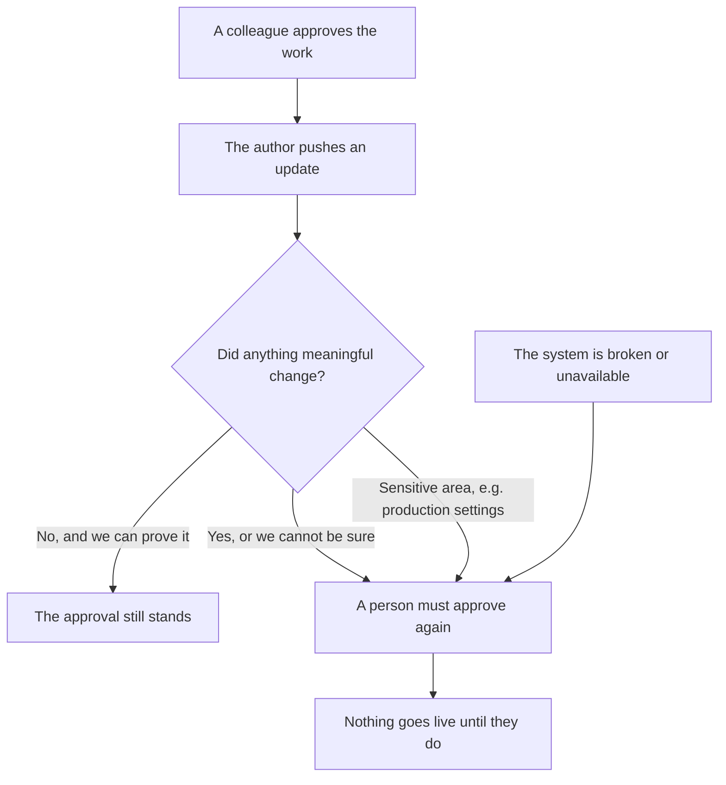

# How It Works — in plain English

*For directors, auditors, and anyone who needs to understand what this system does without*
*reading any code. No technical background assumed. Nothing in this page is simplified to the*
*point of being untrue — where something is uncomfortable, it is stated plainly, especially in*
*"The honest limits" at the end.*

---

## The problem, in one paragraph

When someone proposes a change to our software, a colleague has to read it and approve it before
it can go live. That is the review requirement, and nobody is proposing to weaken it. But today,
the moment the author touches the change again — even to fix a typo in a comment, even to
reformat a line, even when an *unrelated* change from someone else lands first and nudges theirs
— the tool throws the approval away. The reviewer has to come back and approve the identical
work a second time.

This produces a specific, well-known failure: reviewers are asked to look again so often, at
things that so obviously did not change, that they stop looking. The second approval becomes a
reflex. It audits beautifully and verifies nothing. Worse, the tool applies exactly the same
blunt rule to a typo fix as it does to somebody rewriting the payment logic — so the signal that
should mean "stop, look carefully" gets buried in noise.

## What this system does

It replaces the question *"did anything at all get touched?"* with the question *"did anything
that actually matters change?"*

When someone updates an already-approved piece of work, the system compares what was approved
with what is there now, and reaches one of two conclusions:

- **Nothing meaningful changed.** The update was formatting, a comment, a typo, or an unrelated
  change moving underneath. The existing approval stands. Nobody is interrupted.
- **Something real changed — or we cannot be certain it didn't.** A person must look again
  before it can go anywhere. This is exactly what happens today.

There is a deliberate asymmetry in there: **doubt always resolves toward asking a human.** If the
system cannot prove the update was harmless, it treats it as if it were not.

And for a defined list of sensitive areas — anything touching production settings, infrastructure,
security permissions, the build pipeline, or the system's own controls — it does not even try to
form an opinion. Those always require a fresh human look, every single time, no exceptions. **On
those areas the new rule is stricter than the one we have today**, because today's rule can be
satisfied by a tired second click, and this one cannot be satisfied by anything else.

## What happens if the system itself breaks

This is the question every auditor asks first, so here is the answer up front.

**If it breaks, our tooling simply behaves the way it already behaves today: a person has to
approve again.** Nothing unlocks. Nothing merges quietly. There is no timer that eventually gives
up and lets things through, and no emergency mode that relaxes the rules.

That is not a promise about how carefully the software was written. It is a consequence of how it
was wired. The gate that actually blocks a change from going live is GitHub's own built-in
protection setting, configured once by an administrator, and this system holds no ability
whatsoever to change, weaken, or switch off that setting. The system's *only* power is to try to
satisfy that gate. If it is switched off, crashed, or removed entirely, the gate is simply never
satisfied automatically — and a human approval satisfies it, exactly as it always did.

Three things are worth stating explicitly to anyone assessing risk:

1. **No machine in this system can approve anything.** Not the software, not the AI component,
   not any part of it. It cannot approve, cannot merge, cannot change our code. Its entire
   vocabulary is "this approval still counts," "this approval no longer counts," and "no opinion."
2. **Every change that goes live still carries a named human's approval.** That requirement is
   enforced by GitHub itself and this system cannot touch it.
3. **Turning the whole thing off takes minutes, and it is two small administrative changes, not
   a migration.** One change removes the new gate; the second switches the old built-in rule
   back on. The second step matters: adopting this system involves switching that old rule off,
   so removing only the gate would leave neither protection in place. Do both — our written
   shutdown procedure requires it — and everything is exactly as it is today. Nothing has to be
   uninstalled from our repositories beyond, at most, one small helper file.

## The flow, in one picture

## What this means for the business

**Reviewer hours reclaimed.** Every avoided re-review is a senior engineer not context-switching
back into work they already read and already signed off. The exact volume is measured on our own
repositories before anything is deployed — that measurement is the first phase of the rollout and
it is also the point at which we are willing to cancel the project. If our teams do not actually
produce many of these pointless re-reviews, the honest answer is not to build this, and we will
say so.

**Faster delivery on trivial updates.** A typo fix on an approved change currently costs a full
round-trip through another human's attention queue — often hours, sometimes a day. When the
update provably changed nothing, that wait disappears.

**Stronger guarantees where they matter, not weaker.** Today, every change is treated identically,
which in practice means the sensitive ones get the same tired glance as the trivial ones. Under
this system, changes to production configuration, infrastructure, access permissions and the
build pipeline are *categorically* routed to a human, deterministically, with no judgment call
involved and no possibility of an exception. That is a real tightening of a control we currently
enforce only by convention.

**A complete audit trail, which we do not have today.** Right now, "the approval was dismissed
and then re-granted" leaves behind almost nothing — no record of what changed, why it mattered, or
whether the second reviewer actually read it. Under this system, every single decision is written
to an immutable log with the full reasoning behind it: what changed, which rule applied, what
evidence supported the conclusion. A defined sample of those decisions is reviewed by the security
team every week. For change-management and audit-controls obligations, that is a substantially
better artifact than what exists now.

**A small, bounded running cost.** One modest service, and a per-change AI cost measured in
pennies that only applies to the minority of updates the deterministic checks cannot settle on
their own. Both are monitored with alerts.

## The honest limits

There is one thing this system does that deserves to be stated without spin, because it is the
part a careful reader should push on. For updates on non-sensitive areas that the deterministic
checks cannot *prove* harmless, the system asks an AI model to assess whether the change looks
low-impact — and if the model says yes with high confidence, **and** several independent
mechanical safety checks all agree (the change is small, adds no new external dependencies,
touches nothing sensitive), then the existing approval is carried forward and that update goes
live without a second human reading it. The human approval on the work as a whole is still
required and still there; what is being automated is the judgment about whether that approval
remains valid. So the accurate claim is *"every change carries a human approval, and for a
narrow, gated category of follow-up edits a corroborated machine assessment stands in for a
repeat human read"* — not *"every change is read twice by a human."* We deliberately trade a
fatigued second glance for a consistent, logged, sampled machine assessment, on the view that the
former verifies less than it appears to. That trade is a decision for the business to accept or
decline, not an engineering detail: an organisation that will not accept it can run this system
in a mode where the AI component is switched off entirely, keeping only the parts that work by
mathematical proof — and that mode is fully supported, permanently. Separately, and less
consequentially: none of this makes a *first* review better, none of it catches bugs, the exact
benefit varies by team and is measured rather than assumed, and if the system is unavailable
people simply wait for a human — safe, but slower than today for that window.

---

*Deeper reading, in increasing order of technical detail:*
*[ROLLOUT-PLAN.md](ROLLOUT-PLAN.md) (how it gets deployed, and how it gets switched off) ·*
*[SECURITY-REVIEW.md](SECURITY-REVIEW.md) (the security argument) ·*
*[EPIC.md](EPIC.md) (§1 for the precedent at Google and Meta, §8 for the auditor-facing narrative) ·*
*[../README.md](../README.md) (the full technical design).*
